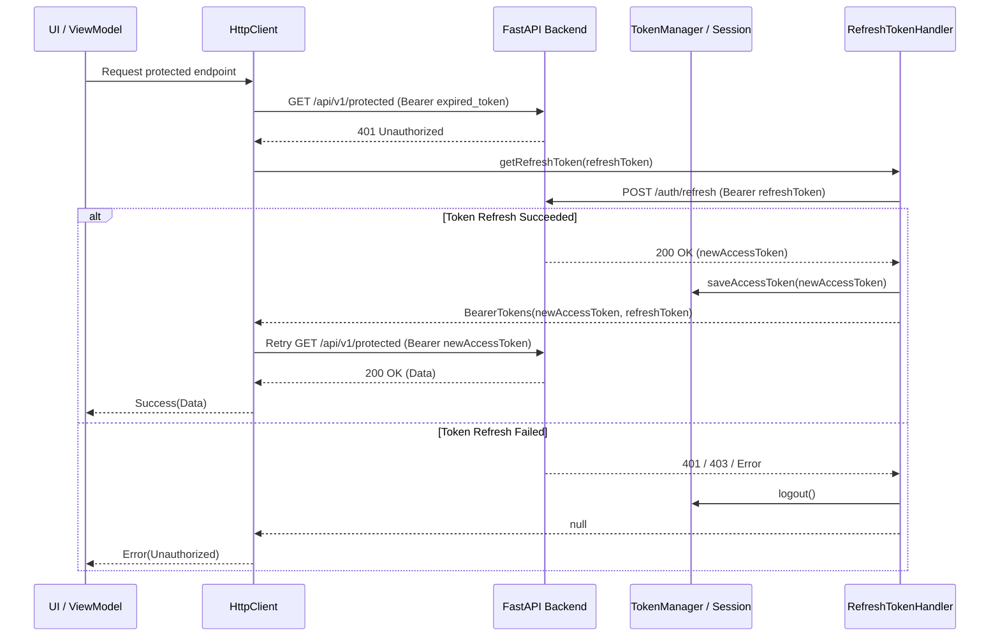

# 🔐 Auth & Refresh Token Guide

This document explains the authentication lifecycle, token persistence, and automatic 401 refresh mechanism in **Talangraga Umroh Mobile**.

---

## 1. Core Components

- **`TokenManager`** (`com.talangraga.data.network.TokenManager`):
  - Reads and persists `accessToken` and `refreshToken` using Multiplatform Settings.
  - Exposes `getAccessToken()` and `getRefreshToken()`.
  - Clears credentials and invalidates session upon `logout()`.

- **`RefreshTokenHandler`** (`com.talangraga.data.network.RefreshTokenHandler`):
  - Creates an isolated `HttpClient` instance (preventing recursion).
  - Sends a POST request to `${BuildKonfig.BASE_URL}auth/refresh` with Bearer header.
  - On `200 OK`, extracts new access token, updates `TokenManager`, and returns updated `BearerTokens`.
  - On failure, calls `tokenManager.logout()` and returns `null`.

- **`HttpClientFactory`** (`com.talangraga.data.network.HttpClientFactory`):
  - Configures the Ktor `Auth` plugin with `bearer { ... }`.
  - Automatically intercepts HTTP 401 Unauthorized responses and calls `refreshTokenHandler.getRefreshToken(...)`.

---

## 2. Refresh Flow

---

## 3. Best Practices
- Never store tokens in plain variables; always rely on `TokenManager`.
- Always verify token refresh logic against unit tests in `data/src/commonTest/kotlin/RefreshTokenTest.kt`.
